# Shopping Mall
> Generated by [`prisma-markdown`](https://github.com/samchon/prisma-markdown)

- [default](#default)

## default

```mermaid
erDiagram
"Account" {
  String _id PK
  String userId FK
  String type
  String provider
  String providerAccountId
  String refresh_token "nullable"
  String access_token "nullable"
  Int expires_at "nullable"
  String token_type "nullable"
  String scope "nullable"
  String id_token "nullable"
  String session_state "nullable"
}
"Session" {
  String _id PK
  String sessionToken UK
  String userId FK
  DateTime expires
}
"User" {
  String _id PK
  String userName
  String email UK
  Boolean emailVerified
  Boolean isActive
  DateTime lastActivity "nullable"
  String password
  UserRole userRole
  String image "nullable"
  String chatIds FK
  DateTime createdAt
  DateTime updatedAt
  Suspended suspended
  String likedFeedImagesIds FK
  String savedFeedImagesIds FK
}
"Photographer" {
  String _id PK
  String userId FK
  String name "nullable"
  String coverPhoto "nullable"
  String bio "nullable"
  String featured
  PhotographerCategory category
  DateTime createdAt
  DateTime updatedAt
}
"Client" {
  String _id PK
  String userId FK
  String name "nullable"
  String bio "nullable"
  DateTime createdAt
  DateTime updatedAt
}
"Admin" {
  String _id PK
  String name
  String userId FK
  DateTime createdAt
  DateTime updatedAt
}
"Chat" {
  String _id PK
  String userIds FK
  String messagesIds
  DateTime createdAt
  DateTime updatedAt
}
"Message" {
  String _id PK
  String chatId FK
  String senderId FK
  String receiverId FK
  String message
  DateTime createdAt
  DateTime updatedAt
}
"Attachment" {
  String _id PK
  String messageId FK
  String type
  String url
}
"Booking" {
  String _id PK
  String clientId FK
  String photographerId FK
  String subject "nullable"
  PhotographerCategory category
  String packageId FK
  DateTime start "nullable"
  DateTime end "nullable"
  String location "nullable"
  BookingStatus status
  DateTime createdAt
  DateTime updatedAt
}
"Offer" {
  String _id PK
  String clientId FK
  String photographerId FK
  String bookingsId FK
  String description
  String clientName
  Float price
  DateTime createdAt
  DateTime updatedAt
}
"Payment" {
  String _id PK
  String clientId FK
  String photographerId FK
  String bookingsId FK
  Float amount
  String currency
  PaymentStatus status
  DateTime createdAt
  DateTime updatedAt
}
"Event" {
  String _id PK
  String title
  String bookingId FK
  String description "nullable"
  DateTime start "nullable"
  DateTime end "nullable"
  Boolean allDay "nullable"
  DateTime createdAt
  DateTime updatedAt
}
"BankDetails" {
  String _id PK
  String photographerId FK
  String bankName
  String accountName
  String accountNumber
  String accountBranch
  String accountBranchCode "nullable"
  DateTime createdAt
  DateTime updatedAt
}
"Earnings" {
  String _id PK
  String photographerId FK
  Float totalAmount
  Float pending
  Float fees
  DateTime date
  DateTime createdAt
  DateTime updatedAt
}
"Report" {
  String _id PK
  String clientId FK "nullable"
  String photographerId FK "nullable"
  String userId FK
  String subject
  String description
  ReportStatus status
  DateTime createdAt
  DateTime updatedAt
}
"Profilereport" {
  String _id PK
  String photographerId FK
  String userId FK
  String subject
  String description
  ReportStatus status
  DateTime createdAt
  DateTime updatedAt
}
"Imagereport" {
  String _id PK
  String userId FK
  String feedImageId FK
  String subject
  String description
  ReportStatus status
  DateTime createdAt
  DateTime updatedAt
}
"Package" {
  String _id PK
  String photographerId FK
  String name
  String description
  String coverPhotos
  Float price
  DateTime createdAt
  DateTime updatedAt
}
"ContactDetails" {
  String _id PK
  String photographerId FK
  String phoneNum1
  String phoneNum2 "nullable"
  String email
  DateTime createdAt
  DateTime updatedAt
}
"Address" {
  String _id PK
  String contactDetailsId FK
  String street
  String city
  String state
  String country
  String zip
  DateTime createdAt
  DateTime updatedAt
}
"SocialMedia" {
  String _id PK
  String contactDetailsId FK
  String facebook "nullable"
  String instagram "nullable"
  String twitter "nullable"
  String linkedin "nullable"
  String youtube "nullable"
  String tiktok "nullable"
  DateTime createdAt
  DateTime updatedAt
}
"Testimonial" {
  String _id PK
  String clientId FK
  String photographerId FK
  TestimonialVisibility visibility
  Int rating
  String review
  DateTime createdAt
  DateTime updatedAt
}
"FeedImage" {
  String _id PK
  String photographerId FK
  String imageUrl
  String likedUserIds FK
  String savedUserIds FK
  Int likeCount
  Int saveCount
  String caption "nullable"
  DateTime createdAt
  DateTime updatedAt
}
"Album" {
  String _id PK
  String photographerId FK
  String name
  String description
  AlbumVisibility visibility
  String coverImage "nullable"
  Float price "nullable"
  PaymentStatus paymentStatus "nullable"
  DateTime createdAt
  DateTime updatedAt
}
"AlbumPayment" {
  String _id PK
  String clientId FK
  String photographerId FK
  String albumId FK
  Float amount
  String currency
  PaymentStatus status
  DateTime createdAt
  DateTime updatedAt
}
"AlbumImage" {
  String _id PK
  String albumId FK
  String image
}
"Notification" {
  String _id PK
  String receiverId FK
  String type
  String title
  String description "nullable"
  Boolean read
  DateTime createdAt
}
"SystemReport" {
  String _id PK
  String userId FK
  String subject
  String description
  SystemReportStatus status
  DateTime createdAt
  DateTime updatedAt
}
"_ChatToUser" {
  String A FK
  String B FK
}
"_FeedImageToUser" {
  String A FK
  String B FK
}
"Account" }o--|| "User" : user
"Session" }o--|| "User" : user
"User" }o--|| "Chat" : chats
"User" }o--|| "FeedImage" : likedFeedImages
"User" }o--|| "FeedImage" : savedFeedImages
"Photographer" |o--|| "User" : user
"Client" |o--|| "User" : user
"Admin" |o--|| "User" : user
"Chat" }o--|| "User" : users
"Message" }o--|| "Chat" : chat
"Message" }o--|| "User" : sender
"Message" }o--|| "User" : receiver
"Attachment" }o--|| "Message" : message
"Booking" }o--|| "Client" : client
"Booking" }o--|| "Photographer" : photographer
"Booking" }o--|| "Package" : package
"Offer" }o--|| "Client" : client
"Offer" }o--|| "Photographer" : photographer
"Offer" |o--|| "Booking" : booking
"Payment" }o--|| "Client" : client
"Payment" }o--|| "Photographer" : photographer
"Payment" |o--|| "Booking" : booking
"Event" |o--|| "Booking" : Booking
"BankDetails" |o--|| "Photographer" : photographer
"Earnings" |o--|| "Photographer" : photographer
"Report" }o--o| "Client" : client
"Report" }o--o| "Photographer" : photographer
"Report" }o--|| "User" : user
"Profilereport" }o--|| "Photographer" : photographer
"Profilereport" }o--|| "User" : user
"Imagereport" }o--|| "User" : user
"Imagereport" }o--|| "FeedImage" : feedImage
"Package" }o--|| "Photographer" : photographer
"ContactDetails" |o--|| "Photographer" : photographer
"Address" |o--|| "ContactDetails" : contactDetails
"SocialMedia" |o--|| "ContactDetails" : contactDetails
"Testimonial" }o--|| "Client" : client
"Testimonial" }o--|| "Photographer" : photographer
"FeedImage" }o--|| "Photographer" : photographer
"FeedImage" }o--|| "User" : likes
"FeedImage" }o--|| "User" : saves
"Album" }o--|| "Photographer" : photographer
"AlbumPayment" }o--|| "Client" : client
"AlbumPayment" }o--|| "Photographer" : photographer
"AlbumPayment" |o--|| "Album" : album
"AlbumImage" }o--|| "Album" : album
"Notification" }o--|| "User" : receiver
"SystemReport" }o--|| "User" : user
"_ChatToUser" }o--|| "Chat" : Chat
"_ChatToUser" }o--|| "User" : User
"_FeedImageToUser" }o--|| "FeedImage" : FeedImage
"_FeedImageToUser" }o--|| "User" : User
```

### `Account`

**Properties**
  - `_id`: 
  - `userId`: 
  - `type`: 
  - `provider`: 
  - `providerAccountId`: 
  - `refresh_token`: 
  - `access_token`: 
  - `expires_at`: 
  - `token_type`: 
  - `scope`: 
  - `id_token`: 
  - `session_state`: 

### `Session`

**Properties**
  - `_id`: 
  - `sessionToken`: 
  - `userId`: 
  - `expires`: 

### `User`

**Properties**
  - `_id`: 
  - `userName`: 
  - `email`: 
  - `emailVerified`: 
  - `isActive`: 
  - `lastActivity`: 
  - `password`: 
  - `userRole`: 
  - `image`: 
  - `chatIds`: 
  - `createdAt`: 
  - `updatedAt`: 
  - `suspended`: 
  - `likedFeedImagesIds`: 
  - `savedFeedImagesIds`: 

### `Photographer`

**Properties**
  - `_id`: 
  - `userId`: 
  - `name`: 
  - `coverPhoto`: 
  - `bio`: 
  - `featured`: 
  - `category`: 
  - `createdAt`: 
  - `updatedAt`: 

### `Client`

**Properties**
  - `_id`: 
  - `userId`: 
  - `name`: 
  - `bio`: 
  - `createdAt`: 
  - `updatedAt`: 

### `Admin`

**Properties**
  - `_id`: 
  - `name`: 
  - `userId`: 
  - `createdAt`: 
  - `updatedAt`: 

### `Chat`

**Properties**
  - `_id`: 
  - `userIds`: 
  - `messagesIds`: 
  - `createdAt`: 
  - `updatedAt`: 

### `Message`

**Properties**
  - `_id`: 
  - `chatId`: 
  - `senderId`: 
  - `receiverId`: 
  - `message`: 
  - `createdAt`: 
  - `updatedAt`: 

### `Attachment`

**Properties**
  - `_id`: 
  - `messageId`: 
  - `type`: 
  - `url`: 

### `Booking`

**Properties**
  - `_id`: 
  - `clientId`: 
  - `photographerId`: 
  - `subject`: 
  - `category`: 
  - `packageId`: 
  - `start`: 
  - `end`: 
  - `location`: 
  - `status`: 
  - `createdAt`: 
  - `updatedAt`: 

### `Offer`

**Properties**
  - `_id`: 
  - `clientId`: 
  - `photographerId`: 
  - `bookingsId`: 
  - `description`: 
  - `clientName`: 
  - `price`: 
  - `createdAt`: 
  - `updatedAt`: 

### `Payment`

**Properties**
  - `_id`: 
  - `clientId`: 
  - `photographerId`: 
  - `bookingsId`: 
  - `amount`: 
  - `currency`: 
  - `status`: 
  - `createdAt`: 
  - `updatedAt`: 

### `Event`

**Properties**
  - `_id`: 
  - `title`: 
  - `bookingId`: 
  - `description`: 
  - `start`: 
  - `end`: 
  - `allDay`: 
  - `createdAt`: 
  - `updatedAt`: 

### `BankDetails`

**Properties**
  - `_id`: 
  - `photographerId`: 
  - `bankName`: 
  - `accountName`: 
  - `accountNumber`: 
  - `accountBranch`: 
  - `accountBranchCode`: 
  - `createdAt`: 
  - `updatedAt`: 

### `Earnings`

**Properties**
  - `_id`: 
  - `photographerId`: 
  - `totalAmount`: 
  - `pending`: 
  - `fees`: 
  - `date`: 
  - `createdAt`: 
  - `updatedAt`: 

### `Report`

**Properties**
  - `_id`: 
  - `clientId`: 
  - `photographerId`: 
  - `userId`: 
  - `subject`: 
  - `description`: 
  - `status`: 
  - `createdAt`: 
  - `updatedAt`: 

### `Profilereport`

**Properties**
  - `_id`: 
  - `photographerId`: 
  - `userId`: 
  - `subject`: 
  - `description`: 
  - `status`: 
  - `createdAt`: 
  - `updatedAt`: 

### `Imagereport`

**Properties**
  - `_id`: 
  - `userId`: 
  - `feedImageId`: 
  - `subject`: 
  - `description`: 
  - `status`: 
  - `createdAt`: 
  - `updatedAt`: 

### `Package`

**Properties**
  - `_id`: 
  - `photographerId`: 
  - `name`: 
  - `description`: 
  - `coverPhotos`: 
  - `price`: 
  - `createdAt`: 
  - `updatedAt`: 

### `ContactDetails`

**Properties**
  - `_id`: 
  - `photographerId`: 
  - `phoneNum1`: 
  - `phoneNum2`: 
  - `email`: 
  - `createdAt`: 
  - `updatedAt`: 

### `Address`

**Properties**
  - `_id`: 
  - `contactDetailsId`: 
  - `street`: 
  - `city`: 
  - `state`: 
  - `country`: 
  - `zip`: 
  - `createdAt`: 
  - `updatedAt`: 

### `SocialMedia`

**Properties**
  - `_id`: 
  - `contactDetailsId`: 
  - `facebook`: 
  - `instagram`: 
  - `twitter`: 
  - `linkedin`: 
  - `youtube`: 
  - `tiktok`: 
  - `createdAt`: 
  - `updatedAt`: 

### `Testimonial`

**Properties**
  - `_id`: 
  - `clientId`: 
  - `photographerId`: 
  - `visibility`: 
  - `rating`: 
  - `review`: 
  - `createdAt`: 
  - `updatedAt`: 

### `FeedImage`

**Properties**
  - `_id`: 
  - `photographerId`: 
  - `imageUrl`: 
  - `likedUserIds`: 
  - `savedUserIds`: 
  - `likeCount`: 
  - `saveCount`: 
  - `caption`: 
  - `createdAt`: 
  - `updatedAt`: 

### `Album`

**Properties**
  - `_id`: 
  - `photographerId`: 
  - `name`: 
  - `description`: 
  - `visibility`: 
  - `coverImage`: 
  - `price`: 
  - `paymentStatus`: 
  - `createdAt`: 
  - `updatedAt`: 

### `AlbumPayment`

**Properties**
  - `_id`: 
  - `clientId`: 
  - `photographerId`: 
  - `albumId`: 
  - `amount`: 
  - `currency`: 
  - `status`: 
  - `createdAt`: 
  - `updatedAt`: 

### `AlbumImage`

**Properties**
  - `_id`: 
  - `albumId`: 
  - `image`: 

### `Notification`

**Properties**
  - `_id`: 
  - `receiverId`: 
  - `type`: 
  - `title`: 
  - `description`: 
  - `read`: 
  - `createdAt`: 

### `SystemReport`

**Properties**
  - `_id`: 
  - `userId`: 
  - `subject`: 
  - `description`: 
  - `status`: 
  - `createdAt`: 
  - `updatedAt`: 

### `_ChatToUser`
Pair relationship table between [Chat](#Chat) and [User](#User)

**Properties**
  - `A`: 
  - `B`: 

### `_FeedImageToUser`
Pair relationship table between [FeedImage](#FeedImage) and [User](#User)

**Properties**
  - `A`: 
  - `B`: 